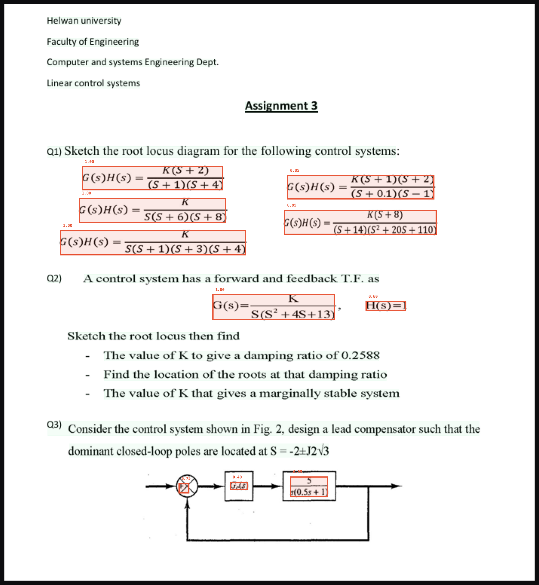

# Equation Detector

A from-scratch mathematical equation localization system for document images — no OpenCV, no NumPy. Built entirely on connected component analysis (CCA), blob statistics, and multi-pass scoring.

---

## Demo



*Red boxes = standalone/display equations (class 0) with confidence scores. The pipeline correctly isolates transfer functions, the block diagram, and the feedback expression while ignoring question text and bullet points.*

---

## What it does

Given a document image (research paper, textbook, assignment sheet, lecture slide), the pipeline:

1. Preprocesses the image — background normalization, contrast stretch, Otsu binarization
2. Finds every ink blob via connected component analysis (BFS, 8-connected)
3. Estimates font size from the modal blob height distribution
4. Detects document density class (sparse / medium / dense)
5. Filters structural lines — table grids, page borders, section rules
6. Groups blobs into candidate regions using two-pass Union-Find
7. Classifies standalone equations (Pass 1) with density-aware scoring
8. Outputs annotated images and a CSV of bounding boxes with confidence scores


---

## Installation

```bash
pip install -r requierments.txt
```

`requirements.txt` contains only: `Pillow`, `matplotlib`, `streamlit`, `pandas`

---

## Usage

### Streamlit app
```bash
streamlit run app.py
```

### Command line (Windows)
```bash
run.bat path\to\image.png results\
```

### Python API
```python
from pipeline.pipeline import run_cca_pipeline

gray, binary, blobs, font_size, text_boxes, eq_results = run_cca_pipeline(
    "paper.png",
    debug=False
)

```


## Output CSV format

| Column | Type | Description |
|--------|------|-------------|
| x1 | int | Left edge of bounding box |
| y1 | int | Top edge of bounding box |
| x2 | int | Right edge of bounding box |
| y2 | int | Bottom edge of bounding box |
| class | int | 0 = standalone, 1 = inline |
| confidence | float | Score normalized to [0, 1] |


## Tuning

### Grouping
| Parameter | Default | Effect |
|-----------|---------|--------|
| `line_v_factor` | 1.2 | Vertical gap for within-line blob merging |
| `para_v_factor` | auto | Vertical gap for paragraph merging (auto-detected) |
| `h_gap_factor` | 2.0 | Horizontal proximity tolerance |

### Standalone detection
| Parameter | Location | Effect |
|-----------|----------|--------|
| `score_threshold` | `standalone_equations.py` cfg | Min score to pass (per density class) |
| `conf_cutoff` | `standalone_equations.py` cfg | Min confidence to keep |
| `frac_w / frac_h` | `standalone_equations.py` cfg | Fraction bar detection thresholds |


---

## Limitations

- **Handwritten documents** — not supported. Blob size distribution is too irregular for reliable font-size estimation.
- **Very low resolution** (< 100 DPI) — Otsu binarization degrades; edges become too thin to detect reliably.
- **Two-column layouts** — grouping occasionally merges across columns. Reduce `h_gap_factor` to 1.5 if this occurs.
- **Tables** — table cell contents can score as equations if the line filter does not remove grid lines. Ensure `filter_line_blobs` is called before grouping.
- **Colored backgrounds** — handled by background normalization, but very saturated colors (dark red, dark blue) may still compress the grayscale range.

---

## No dependencies on

- OpenCV
- NumPy
- scikit-image
- Any ML model or pretrained weights
